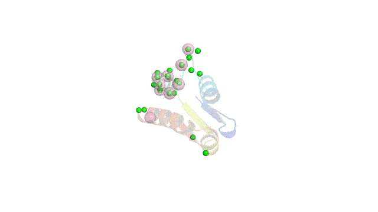

# ISPIP: 

---
## Written by Evan Edelstein 

## Manuscript by R. Viswanathan, M. Walder, E. Edelstein, S. Lazarev, M. Carroll, J.E. Fajardo, A. Fiser
---
### Motivation: 

Identifying protein interfaces is important to learn how proteins interact with their binding partners, to uncover the regulatory mechanisms to control biological functions and to develop novel therapeutic agents. A variety of computational approaches have been developed for predicting a protein’s interfacial residues from its sequence features, such as physico-chemical properties of residues, as well as using structure-based information from known interfaces that share high sequence or structure similarity. Structure-based methods that rely on finding suitable templates will not be successful in predicting interfaces when structural homologues with known complex structures are not available. 

 In this work, we describe the development of an integrated method to explore the hypothesis that the efficacy of a computational prediction method of protein binding sites can be enhanced by using a combination of methods that rely on orthogonal structure-based properties of a query protein, combining and balancing both template-free and template-based features. ISPIP is a method that integrates these approaches by linear or logistic regression, random forest, or Gradient boosted tree models. ISPIP on a diverse test set of query proteins outperforms each of its individual classifiers in identifying protein binding interfaces.

---
<!-- 

 -->

<h3> Requirements: </h3>

* python3  (tested with 3.7 and above)
* packages listed in requirements.txt to install execute 'pip3 install -r requirements.txt' 	
* optional: pymol, dtreeviz and graphviz

<h3>Usage: </h3>
	
- `git clone https://github.com/eved1018/ISPIP.git`
- `cd ISPIP`
- `python -m ISPIP` 

<h3>Arguments:</h3>

- Input/Output:
	* `-if`: [str] default: input - Directory containing input data.
	* `-of`: [str] default: output - Directory to place output of MeatDPI.
	* `-i`: [str] default: input.csv - Csv file should be in input folder.
	* `-cv`: [str] default: cv - Directory containing test and train sets for cross-validation. 
	* `-trainset`: [str] default: test_set.txt - Filename containing proteins for models to train on should be in input folder.
	* `-testset`: [str] default: train_set.txt - Filename containing proteins for models to test on should be in input folder.
	* `-cutoffs`: [str] default:'cutoffs.csv' - Filename containing length of interface or precalculated cutoff for each protein. 
	* `-model_name`: [str] default:'model' - Name of models to import/export.

- Mode selection:
	* `-mode`: ['predict', 'test', 'generate','cv','viz'] default: 'predict'  
		* __predict__: Use pre-trained model in input folder to predict on set.
		* __generate__: Generate a new rf model from a test set without predicting on any data.
		* __test__: Generate a new rf model from a test set and train on a training set.
		* __viz__: Only call the pymol visualization function.
		* __cv__: perform cross-validation and hyperparameter tuning of models on split training set, the best models are then used to predict on a designated testing set. 

- Parameters: 
	* `-randomforest_parameter_trees`: [integer] default: 10 - Scikit learn 'n_estimators' parameter.
	* `-random_forest_parameter_depth`: [integer] default: None - Scikit learn 'max_depth' parameter.
	* `-random_forest_parameter_ccp`: [float] default: 0.0 - Scikit learn 'ccp_alpha' parameter. (https://scikit-learn.org/stable/modules/tree.html#minimal-cost-complexity-pruning).
	* `-autocutoff`: [int] default: 15 - If no cutoff file is used this sets the default interface cutoff value.

- Flags: 
	* `-pymol`: Output pymol session and image of protein with experimental and predicted interfaces overladed. 
	* `-tv`: Output svg image of a randomly sampled tree (for large datasets this can take up a huge amount of time and space) see https://github.com/parrt/dtreeviz for details.
	* `-xg`: Include the use of gradient boosting regression model.
	* `-nn`: Include the use of Multi-layer Perceptron regressor model.

Output:

- results.csv: this file contains the fscore, MCC, Roc AUC and PR AUC for each individual method and model. 

- roc_model.csv and pr_model.csv: the TRP and FPR by threshold for each individual method and model, can be used to generate specific ROC or PR graphs.

- fscore_mcc_by_protein: the individual fscore and mcc for each protein in the test set. 

- *.joblib: the trained models from a generate, test or cv run. Move these into the input directory to be used with 'predict' mode. 

- pairtest.csv: Comparison of statistical significance between AUCs.
	- top triangle: difference in pairs of AUCs
	- bottom triangle: log(10) of p-values for the difference in pairs of AUCs.
- proteins: Directory containing pymol sessions for each protein in the test set.  
- cvout: Directory containing the best parameters for each model used in the final prediction, as well as the individual metrics over each cross validation step. 

<!-- Example: 
|   | predictor         | f-score | mcc    | roc_auc | pr_auc |
| - | ----------------- | ------- | ------ | ------- | ------ |
| 0 | predus            | 0.337   | 0.2776 | 0.665   | 0.235  |
| 1 | ispred            | 0.370   | 0.314  | 0.816   | 0.358  |
| 2 | dockpred          | 0.263   | 0.196  | 0.652   | 0.152  |
| 3 | logisticregresion | 0.374   | 0.318  | 0.841   | 0.326  |
| 4 | linearregression  | 0.372   | 0.316  | 0.842   | 0.324  |
| 5 | randomforest      | 0.403   | 0.350  | 0.846   | 0.369  |
| 6 | xgboost           | 0.422   | 0.371  | 0.853   | 0.435  | -->

---
### Special thanks to:

Dr. Andras Fiser and Dr. Eduardo J Fajardo for insight and guidance.
 

Terence Parr and Prince Grover for use of dtreeviz.

<!-- 

  -->
	

